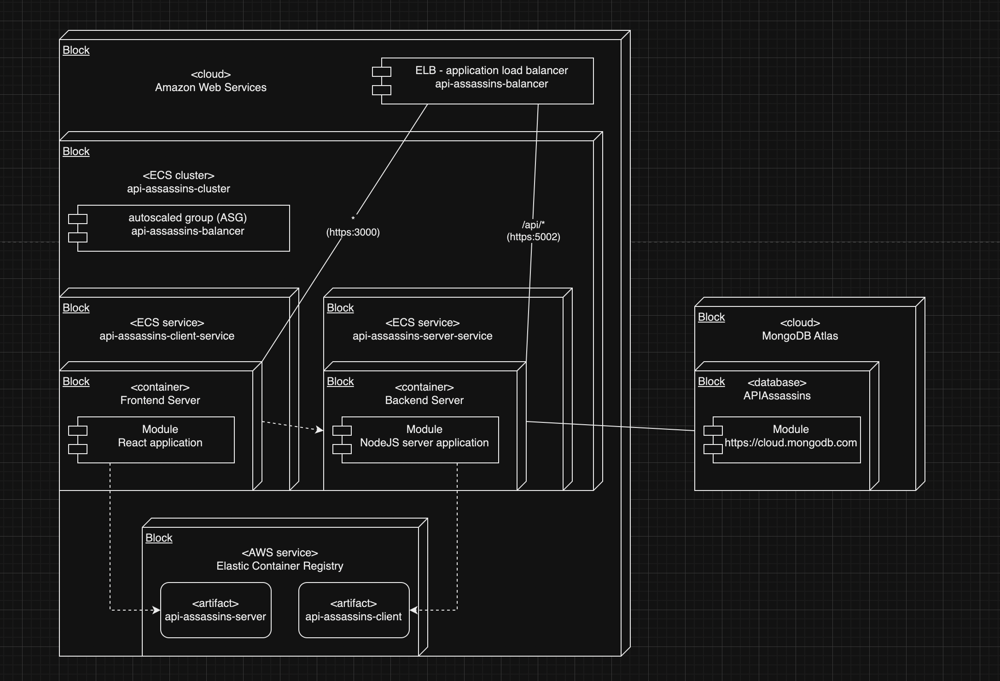
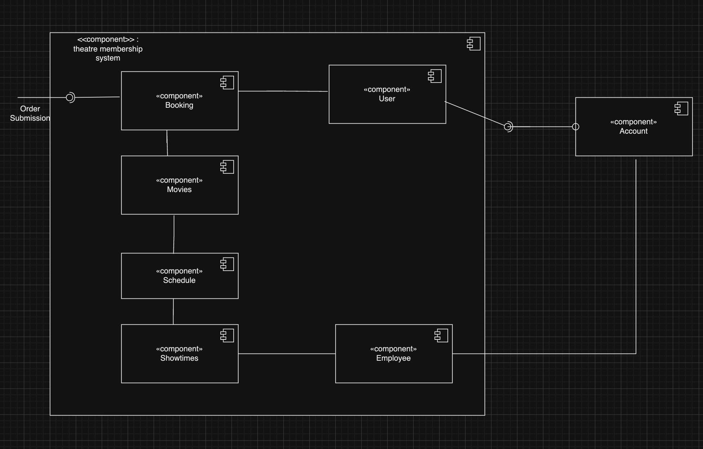

Team API_Assasins
Weihua  Zhao
Raymond Wu
Bunpheng Chhay


## Summary of Contributution:
Raymond Wu: Raymond contribted to building profile (history, payment, security/change password), login/register, forgot password, and deployment to AWS. He also contributed building parts of API CRUD operations for movie database and corresponding databases. He also contributed to polishing the deployment diagram. 

Bunpheng Chhay: Bunpheng contributed to building the infrastructure code of the project. He also contributed to building the homepage, navigation bar, showtimes, location, employee dashboard, and membership. He also contributed to building parts of API CRUD operations for theatre database and corresponding databases. 

Weihua Zhao: Weihua contributed to building shopping cart, location, and payment page for the front end. He also contributed to building parts of the API CRUD operations for user and booking database. He also contributed to organizing the sprint task sheet and diagrams. 

## GitHub Repo
https://github.com/gopinathsjsu/team-project-api_assassins


## UML Deployment Diagram

<!--  -->


## UML Component Diagram

<!--  -->


## Project Board

https://api-assassins-balancer-2018757611.us-east-1.elb.amazonaws.com/


## Project Journal
https://docs.google.com/document/d/16_o97lh9s94LxwPmAc670GeNG0syQ95Ve3M9kiIGo2s/edit?usp=drive_link

## Project Sprint Task Sheet
https://docs.google.com/spreadsheets/d/1lykODkxHeyZ9Jgf8ArMlQVkCyHZGcXo6/edit?usp=drive_link&ouid=108646221975700683379&rtpof=true&sd=true


## Requirments
Before you begin, please ensure you have the following prerequisites installed on your system:

- [Node.js](https://nodejs.org/): Make sure you have Node.js installed. You can check if it's installed by running the following commands in your terminal:

   ```bash
   node -v
   npm -v

### Getting Started

    git clone git@github.com:gopinathsjsu/team-project-api_assassins.git

### Install Dependencies

    cd team-project-api_assassins/clients
    npm install
    cd ../server
    pip install -r requirements.txt

    For iOS users:

    cd team-project-api_assassins/clients
    npm install
    cd ../server

    run the command lines from requirements.txt line by line in your terminal
    
### Other Installations
    cd team-project-api_assassins/clients
    npm install react-bootstrap bootstrap
    npm install react-router-dom
    npm install --save @fortawesome/react-fontawesome @fortawesome/fontawesome-svg-core @fortawesome/free-solid-svg-icons

### Concurrent running dependencies
#### This dependencies will help to run both client and server folder at the same time with the npm run dev. This installation must be installed at the root directory.
    cd team-project-api_assassins
    npm install concurrently --save-dev
    npm install @babel/plugin-proposal-private-property-in-object --save-dev


### Usage
#### Concurrent Running of Server and Clients:

    cd team-project-api_assassins
    npm run dev

### Install Dependency for Test
    npm install selenium-webdriver mocha chai